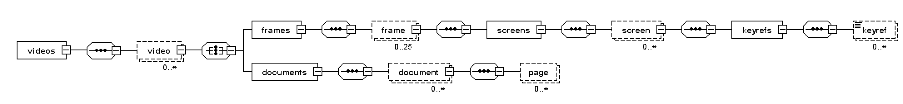

.. image:: https://github.com/video699/implementation-videos/actions/workflows/test.yml/badge.svg
      :target: https://github.com/video699/implementation-videos/actions/workflows/test.yml
      :alt: Continuous Integration

This is an XML dataset of *17 lecture recordings* randomly sampled from the
lectures recorded at the `Faculty of Informatics, Brno, Czechia
<https://www.fi.muni.cz/>`_ during 2010–2016. We drew a stratified sample of up
to *25 video frames* from each recording. In each video frame, we annotated
*lit projection screens* and their condition. For each lit projection screen,
we annotated *lecture materials* shown in the screen. The dataset contains *699
projection screen annotations*, and *925 lecture materials*. Video frames and
lecture materials are encoded as 8-bit PNG images.

The XML schema ``schema.xsd`` describes the structure of the dataset. Section
3 of [Novotny18]_ describes the details of building the dataset.  The `linked
presentation
<https://github.com/video699/implementation-report/releases/download/2018/11/26/beamer.pdf>`_
outlines the `system <https://github.com/video699/implementation-system>`_ for
which the dataset was built.  In our `experiments
<https://github.com/video699/implementation-system/blob/master/docs/notebooks/siamese-cnn-evaluation.ipynb>`_,
we split the dataset into 16 training videos and one validation video using
leave-one-our cross-validation.

.. [Novotny18] NOVOTNÝ, Vít. Slide retrieval based on lecture recordings. Brno,
   2018. 27 pp. Available from:
   `<https://github.com/video699/research-report/releases/download/2018/01/19/handout.pdf>`_
